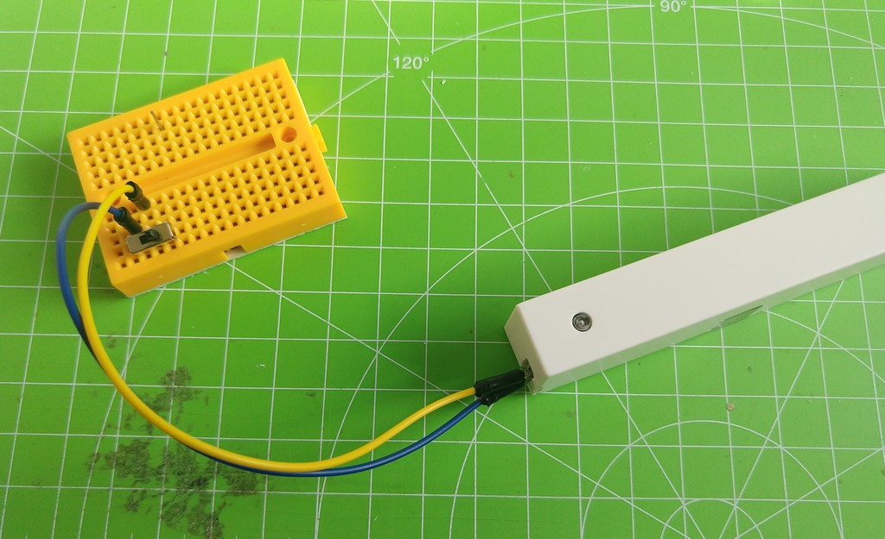
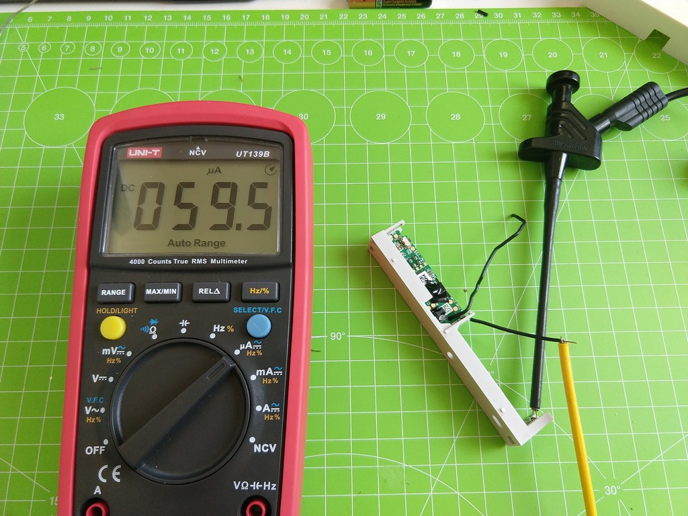
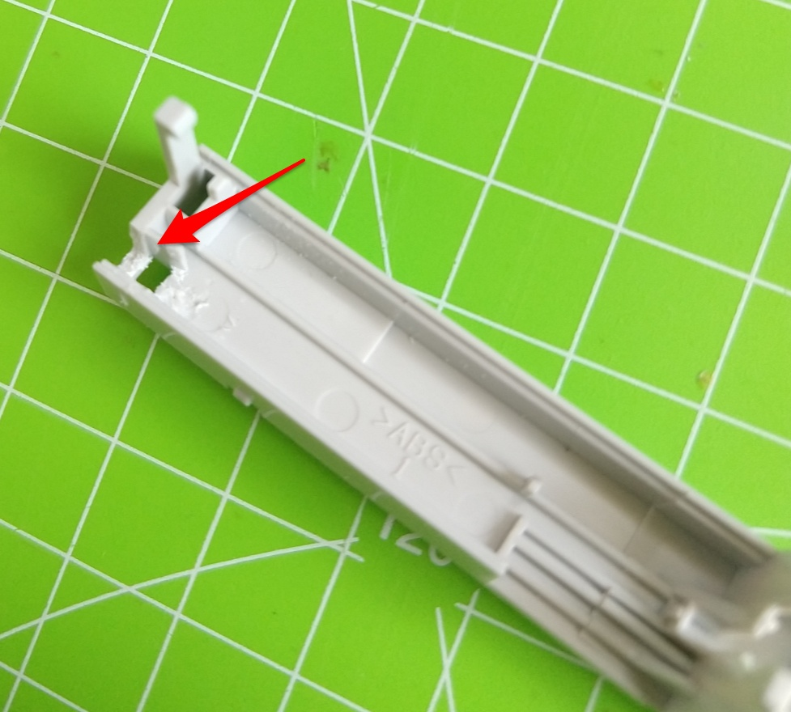
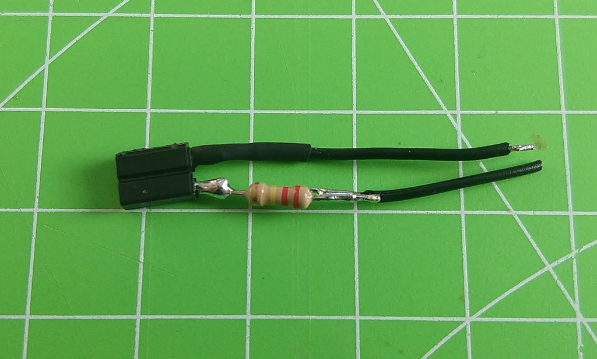
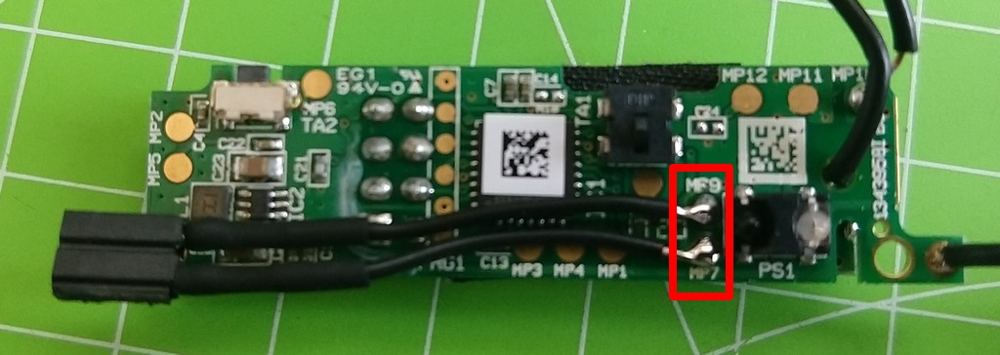
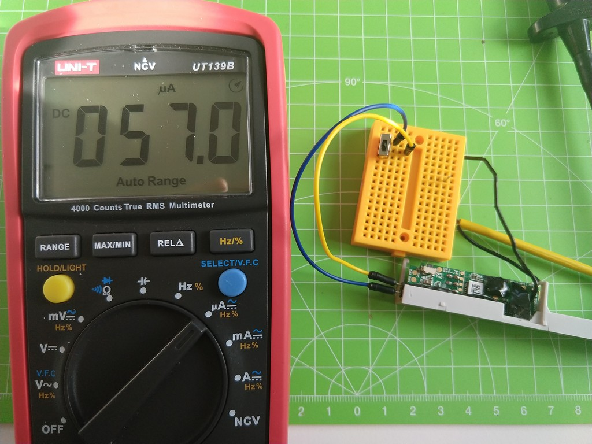

# HM-Sec-SCo Umbau auf externen Schalter / Reedkontakt

Umbau eines HM-Sec-SCo (Optisch) auf externen Schalter. 
Der Optische Sensor funktioniert nach dem Umbau immer noch und kann wenn der Klebestreifen abgemacht wird wieder genutzt werden. 

## Material
- Wiederstand 220 kOhm 
- Buchsenleiste mit zwei Pins
- Schrumpfschlauch
- Schwarzes Klebeband

## Strom verbrauch vor Umbau
Der Strom verbrauch schwankt vor dem Umbau zwischen 80 und 20 µA 

## Umbau
In das Gehäuse eine Aussparung für die Buchsenleiste mit einem Messer oder Drehmel machen

An die Buchsenleiste den Wiederstand und etwas Kabel löten und mit Schrumpfschlauch schützen.

Die Kabelenden an MP9 und MP7 löten

Den Sensor PS1 mit etwas schwarzem Klebeband abdecken und das Gehäuse wieder zusammenbauen.

## Strom verbrauch nach Umbau
Nach dem Umbau schwankt der verbrauch zwischen 80 und 30 µA
